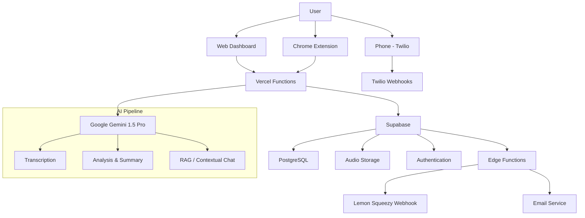

# Diktalo - AI-Powered Voice Intelligence Platform 🧠🎙️

> **Transform conversations into actionable intelligence.** Capture, transcribe, analyze, and chat with your audio recordings.


Diktalo is a complete **Conversational Intelligence Operating System** that unifies your meetings (Google Meet, Zoom, Teams), phone calls, and audio files into a single digital brain powered by AI.

---

## 🚀 Core Features

### 1. Omnichannel Capture
- **Web Recorder:** High-fidelity browser-based voice recording
- **Chrome Extension (MV3):** Capture tab audio (Meet, Teams, Zoom) without intrusive meeting bots
- **Twilio Integration:** Record and process real phone calls automatically
- **Multi-Audio Upload:** Upload 10+ files at once with parallel processing

### 2. AI Intelligence Engine
- **Accurate Transcription:** Whisper-class engine for verbatim text
- **Thematic Summaries:** Auto-detect key topics, decisions, and action items
- **Smart Chat (3 Levels):**
  - *Global Chat:* "Search all my meetings when we discussed budget"
  - *Folder Chat:* "Summarize Project X progress across these 5 recordings"
  - *Audio Chat:* Query a specific meeting

### 3. Organization & Security
- **Smart Folders:** Organize by client, project, or team
- **Row Level Security (RLS):** Database-level data isolation (Supabase)
- **Export:** Professional PDF/DOCX formatting
- **RAG-Powered Search:** Vector embeddings for semantic search

---

## 🏗️ Technical Architecture

### Tech Stack

**Frontend:**
- React 18 + TypeScript
- Vite (build tool)
- Tailwind CSS + Framer Motion
- React Router v6

**Backend:**
- Vercel Serverless Functions
- Supabase (PostgreSQL + Storage + Auth + Edge Functions)
- Google Gemini 1.5 Pro (AI)
- Twilio (phone integration)
- Lemon Squeezy (payments)
- Resend (transactional emails)

**Architecture:**



---

## 🛠️ Quick Start

### Prerequisites
- Node.js 18+
- npm or yarn
- Supabase account
- Google AI Studio API key

### 1. Clone and Install

```bash
git clone https://github.com/diegogalmarini/IntelliScribe.git diktalo
cd diktalo
npm install
```

### 2. Environment Setup

Create `.env.local`:

```env
# Supabase
VITE_SUPABASE_URL=https://your-project.supabase.co
VITE_SUPABASE_ANON_KEY=your_anon_key

# Google Gemini AI
GEMINI_API_KEY=your_gemini_api_key

# Twilio (optional - for phone integration)
TWILIO_ACCOUNT_SID=your_twilio_sid
TWILIO_AUTH_TOKEN=your_twilio_token
TWILIO_PHONE_NUMBER=+1234567890

# Lemon Squeezy (payments)
LEMONSQUEEZY_API_KEY=your_ls_api_key
LEMONSQUEEZY_WEBHOOK_SECRET=your_webhook_secret

# Resend (emails)
RESEND_API_KEY=your_resend_key
```

### 3. Database Setup

Run migrations:

```bash
# Apply all migrations to your Supabase project
npx supabase db push --project-ref your_project_ref
```

### 4. Deploy Edge Functions

```bash
# Deploy Lemon Squeezy webhook
npx supabase functions deploy lemon-webhook --project-ref your_project_ref --no-verify-jwt

# Set secrets
npx supabase secrets set RESEND_API_KEY=your_key --project-ref your_project_ref
npx supabase secrets set LEMONSQUEEZY_WEBHOOK_SECRET=your_secret --project-ref your_project_ref
```

### 5. Run Development Server

```bash
npm run dev
# Open http://localhost:5173
```

### 6. Load Chrome Extension

1. Navigate to `chrome://extensions/`
2. Enable "Developer mode"
3. Click "Load unpacked"
4. Select the `/chrome-extension` folder

---

## 📂 Project Structure

```
diktalo/
├── .agent/                      # AI agent workflows and skills
│   ├── skills/                  # Custom agent capabilities
│   └── workflows/               # Deployment and dev workflows
├── api/                         # Vercel serverless functions
│   ├── analyze-audio.js         # Audio processing endpoint
│   ├── gemini-chat.js           # Chat with recordings
│   ├── process-audio.js         # Transcription pipeline
│   └── twilio-webhook.js        # Phone call handling
├── chrome-extension/            # Chrome Extension (Manifest V3)
│   ├── background.js            # Service worker
│   ├── content.js               # Tab audio capture
│   └── manifest.json            # Extension config
├── components/                  # Reusable UI components
│   ├── Landing/                 # Landing page sections
│   ├── RecordingCard.tsx        # Audio card UI
│   └── Toast.tsx                # Notifications
├── docs/                        # Documentation
│   └── deployment/              # Deployment guides
├── pages/                       # Application routes
│   ├── admin/                   # Admin dashboard
│   ├── intelligence/            # Main app dashboard
│   └── Landing.tsx              # Public homepage
├── scripts/                     # Utility scripts
├── services/                    # Business logic layer
│   ├── geminiService.ts         # AI integration
│   ├── paymentService.ts        # Lemon Squeezy integration
│   └── supabaseService.ts       # Database operations
├── supabase/
│   ├── functions/               # Edge Functions
│   │   └── lemon-webhook/       # Payment webhooks + emails
│   └── migrations/              # Database migrations
├── utils/                       # Helper utilities
│   ├── blogData.ts              # Blog content
│   └── translations.ts          # i18n strings
├── App.tsx                      # Main app component
├── index.tsx                    # Entry point
└── vite.config.ts               # Build configuration
```

---

## 🗄️ Database Schema

### Core Tables

- **`profiles`** - User accounts and subscription data
- **`recordings`** - Audio metadata and transcriptions
- **`folders`** - Organization hierarchy
- **`embeddings`** - Vector embeddings for RAG
- **`plans_configuration`** - Subscription plan settings

### Key Features

- ✅ Row Level Security (RLS) on all tables
- ✅ Real-time subscriptions enabled
- ✅ Automatic timestamps (`created_at`, `updated_at`)
- ✅ Foreign key relationships with cascade deletes

**See:** `supabase/migrations/` for complete schema

---

## 💳 Payment Integration

### Lemon Squeezy Setup

1. Create products in Lemon Squeezy dashboard
2. Copy checkout UUIDs
3. Configure in Admin Panel: `/admin/plans`
4. Webhook processes subscriptions automatically

**Supported Events:**
- `subscription_created` → Send welcome email
- `subscription_updated` → Send plan change email
- `subscription_cancelled` → Send cancellation email

**Email Language:** Automatically detects Spanish/English based on user preference

---

## 📧 Email System

### Transactional Emails (Resend)

Bilingual emails (ES/EN) for:
- New subscription welcome
- Plan upgrades/downgrades
- Subscription cancellations

**Configuration:**
1. Verify domain in Resend dashboard
2. Set `RESEND_API_KEY` in Supabase secrets
3. Deploy `lemon-webhook` Edge Function

**Templates:** `supabase/functions/lemon-webhook/email-templates.ts`

---

## 🚀 Deployment

### Vercel (Frontend + API)

```bash
# Install Vercel CLI
npm i -g vercel

# Deploy
vercel --prod
```

### Supabase (Database + Edge Functions)

```bash
# Link to project
npx supabase link --project-ref your_project_ref

# Push database changes
npx supabase db push

# Deploy Edge Functions
npx supabase functions deploy lemon-webhook --no-verify-jwt
```

**Environment Variables:** Configure in Vercel dashboard

---

## 🧪 Testing

### Run Tests

```bash
npm test
```

### Test Webhooks Locally

```bash
# Start local Supabase
npx supabase start

# Serve Edge Function locally
npx supabase functions serve lemon-webhook
```

---

## 📄 Documentation

- [Deployment Guide](./docs/deployment/)
- [API Reference](./docs/api/)
- [Database Schema](./supabase/migrations/)
- [Email Setup](./docs/resend-setup.md)

---

## 🛣️ Roadmap

### Recently Completed ✅
- [x] UUID-based checkout simplification (Lemon Squeezy)
- [x] Bilingual email notifications (ES/EN)
- [x] Transcription stability improvements (retry logic, defensive guards)
- [x] Emergency 404 fix (SPA rewrites)
- [x] File size validation (10MB limit)

### In Progress 🚧
- [/] Exponential backoff retry logic (DONE - Testing in production)
- [ ] Speaker identification (diarization)
- [ ] Snapshot capture in Chrome Extension
- [ ] RAG vector search optimization
- [ ] Rate limiting implementation

### Planned 📋
- [ ] Async transcription pipeline (for >10 min audio)
- [ ] Audio compression (OPUS 16kHz)
- [ ] Metadata caching layer
- [ ] Mobile app (React Native)
- [ ] Slack/Teams integration
- [ ] Advanced analytics dashboard
- [ ] API for third-party integrations

---

## 🤝 Contributing

Contributions are welcome! Please read our contributing guidelines.

1. Fork the repository
2. Create a feature branch
3. Make your changes
4. Submit a pull request

---

## 📝 License

© 2026 Diktalo Intelligence. All rights reserved.

---

## 🆘 Support

- **Email:** soporte@diktalo.com
- **Documentation:** [docs.diktalo.com](https://www.diktalo.com/docs)
- **Status:** [status.diktalo.com](https://www.diktalo.com)

---

**Built with ❤️ in Spain 🇪🇸**
