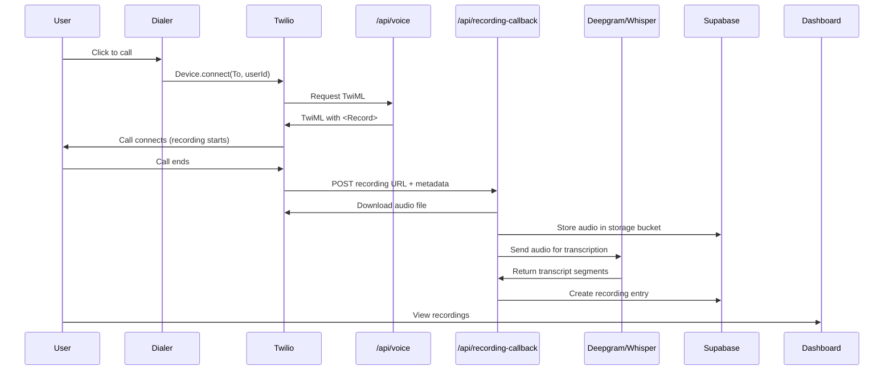

# Call Recording & Transcription Implementation Plan

## Overview

Enable automatic recording and transcription of all calls made through Diktalo's Dialer, storing audio files and transcripts in Supabase for user review.

---

## Current State Analysis

### ✅ What We Have
- **Twilio Voice SDK**: Already making calls via Device.connect()
- **TwiML Endpoint**: `/api/voice.ts` generates call instructions
- **Database Schema**: `recordings` table with fields for audio_url, segments (transcript), duration
- **Storage**: Supabase storage bucket `recordings` (mentioned in SQL)
- **UI**: Dashboard already displays recordings with transcript viewer

### ❌ What's Missing
- Twilio recording not enabled in TwiML
- No webhook to receive recording URLs from Twilio
- No transcription service integration
- Audio files not downloaded/stored
- No automatic creation of recording entries after calls

---

## Technical Architecture

### Flow Diagram



---

## Implementation Steps

### Phase 1: Enable Twilio Recording

#### Modify `/api/voice.ts`

**Current Code** (line 94):
```typescript
const dial = twiml.dial({
    callerId: callerId,
    answerOnBridge: true,
    timeout: 30
});
```

**New Code**:
```typescript
const dial = twiml.dial({
    callerId: callerId,
    answerOnBridge: true,
    timeout: 30,
    record: 'record-from-answer-dual',  // Record both sides
    recordingStatusCallback: `${process.env.VERCEL_URL || 'https://www.diktalo.com'}/api/recording-callback`,
    recordingStatusCallbackEvent: ['completed']
});
```

**Parameters Explained**:
- `record: 'record-from-answer-dual'`: Records both caller and recipient
- `recordingStatusCallback`: Webhook URL Twilio calls when recording is ready
- `recordingStatusCallbackEvent: ['completed']`: Only notify when recording is done

---

### Phase 2: Create Recording Webhook

#### New File: `/api/recording-callback.ts`

**Purpose**: Receive Twilio's callback with recording metadata and URL

**Request Body from Twilio**:
```typescript
{
  AccountSid: string,
  CallSid: string,
  RecordingSid: string,
  RecordingUrl: string,
  RecordingStatus: 'completed',
  RecordingDuration: string, // seconds as string
  RecordingChannels: string,
  RecordingStartTime: string,
  RecordingSource: string,
  To: string,  // Number called
  From: string, // Caller ID used
  // Custom params we can add
  userId?: string
}
```

**Workflow**:
1. Validate Twilio request (check signature for security)
2. Extract userId from custom params
3. Download audio file from `RecordingUrl`
4. Upload to Supabase Storage (`recordings/{userId}/{recordingSid}.mp3`)
5. Initiate transcription
6. Create recording entry in database
7. Return 200 OK to Twilio

**Key Challenge**: How to pass `userId` to this webhook?
- **Solution**: Add custom parameter to TwiML that Twilio forwards

**Updated `/api/voice.ts`**:
```typescript
const dial = twiml.dial({
    // ...existing params
    recordingStatusCallback: `${baseUrl}/api/recording-callback?userId=${userId}`,
});
```

---

### Phase 3: Audio Storage

#### Supabase Storage Configuration

**Bucket**: `recordings`
**Path Structure**: `{userId}/{recordingSid}.mp3`

**Storage Policy** (add to Supabase):
```sql
create policy "Users can view own recordings"
  on storage.objects for select
  using (
    bucket_id = 'recordings' 
    AND auth.uid()::text = (storage.foldername(name))[1]
  );

create policy "Server can insert recordings"
  on storage.objects for insert
  with check (
    bucket_id = 'recordings'
    AND (storage.foldername(name))[1] IS NOT NULL
  );
```

**Download & Upload Logic**:
```typescript
// Download from Twilio
const twilioAuth = Buffer.from(
  `${process.env.TWILIO_ACCOUNT_SID}:${process.env.TWILIO_AUTH_TOKEN}`
).toString('base64');

const audioResponse = await fetch(recordingUrl + '.mp3', {
  headers: { 'Authorization': `Basic ${twilioAuth}` }
});

const audioBuffer = await audioResponse.arrayBuffer();

// Upload to Supabase
const fileName = `${userId}/${recordingSid}.mp3`;
const { data, error } = await supabase.storage
  .from('recordings')
  .upload(fileName, audioBuffer, {
    contentType: 'audio/mpeg',
    upsert: false
  });
```

---

### Phase 4: Transcription Integration

#### Option A: Deepgram (Recommended)
**Pros**: Fast, accurate, speaker diarization, affordable
**Pricing**: ~$0.0043/minute
**Setup**: API key only

```typescript
import { createClient } from '@deepgram/sdk';

const deepgram = createClient(process.env.DEEPGRAM_API_KEY);

const { result, error } = await deepgram.listen.prerecorded.transcribeUrl(
  { url: publicAudioUrl },
  {
    model: 'nova-2',
    language: 'es',  // or 'auto' for auto-detect
    diarize: true,   // Separate speakers
    punctuate: true,
    utterances: true
  }
);

// Convert to TranscriptSegment[]
const segments = result.utterances.map((utt, i) => ({
  id: `seg-${i}`,
  timestamp: formatTime(utt.start),
  speaker: `Speaker ${utt.speaker}`,
  speakerColor: getSpeaker Color(utt.speaker),
  text: utt.transcript,
  confidence: utt.confidence
}));
```

#### Option B: OpenAI Whisper
**Pros**: Very accurate, built-in by OpenAI
**Pricing**: ~$0.006/minute
**Limitation**: No speaker diarization (all one speaker)

```typescript
import OpenAI from 'openai';

const openai = new OpenAI({ apiKey: process.env.OPENAI_API_KEY });

const transcription = await openai.audio.transcriptions.create({
  file: audioFileStream,
  model: 'whisper-1',
  language: 'es',
  response_format: 'verbose_json',
  timestamp_granularities: ['segment']
});

// Convert segments
const segments = transcription.segments.map((seg, i) => ({
  id: `seg-${i}`,
  timestamp: formatTime(seg.start),
  speaker: 'Speaker 1',  // No diarization
  speakerColor: '#3B82F6',
  text: seg.text,
  confidence: seg.confidence || 0.9
}));
```

**Recommendation**: Start with **Deepgram** for speaker diarization

---

### Phase 5: Database Updates

#### New Column in `profiles` Table
```sql
ALTER TABLE public.profiles
ADD COLUMN IF NOT EXISTS caller_id_verified BOOLEAN DEFAULT FALSE;
```

**Already done!** ✅

#### Recording Entry Creation

**After transcription completes**:
```typescript
const { data: recording, error } = await supabase
  .from('recordings')
  .insert({
    user_id: userId,
    title: `Call to ${toNumber}`,
    description: `Recorded call on ${new Date().toLocaleDateString()}`,
    date: new Date().toISOString(),
    duration: formatDuration(durationSeconds),
    duration_seconds: parseInt(durationSeconds),
    status: 'Processed',
    audio_url: publicAudioUrl,
    segments: segments,  // Transcript
    participants: segments.length > 0 ? uniqueSpeakers.length : 2,
    folder_id: 'all'
  })
  .select()
  .single();
```

---

### Phase 6: UI Updates

#### Dashboard - Recordings Tab

**Already exists!** Just needs data from backend.

**What happens automatically**:
1. User makes call → Recording created
2. User navigates to Dashboard
3. `databaseService.getRecordings()` fetches from Supabase
4. Dashboard displays recording card
5. User clicks → Recording viewer opens with transcript

**Missing Feature**: Real-time updates
- **Solution**: Polling or Supabase realtime subscription

**Optional Enhancement**:
```typescript
// In App.tsx or Dashboard
useEffect(() => {
  const channel = supabase
    .channel('recordings-changes')
    .on(
      'postgres_changes',
      {
        event: 'INSERT',
        schema: 'public',
        table: 'recordings',
        filter: `user_id=eq.${user.id}`
      },
      (payload) => {
        setRecordings(prev => [payload.new, ...prev]);
      }
    )
    .subscribe();

  return () => { supabase.removeChannel(channel); };
}, [user.id]);
```

---

## Environment Variables Required

### Existing (Already Set)
- ✅ `TWILIO_ACCOUNT_SID`
- ✅ `TWILIO_AUTH_TOKEN`
- ✅ `TWILIO_CALLER_ID`
- ✅ `SUPABASE_URL`
- ✅ `SUPABASE_SERVICE_ROLE_KEY`

### New Variables Needed
```env
# Transcription Service
DEEPGRAM_API_KEY=your_deepgram_api_key

# OR (alternative)
OPENAI_API_KEY=your_openai_api_key

# App URL (for webhooks)
VERCEL_URL=www.diktalo.com
```

---

## Testing Plan

### Manual Testing

1. **Enable Recording**:
   - Deploy updated `/api/voice.ts`
   - Make test call from Dialer
   - Verify Twilio shows "Recording" status in console

2. **Webhook Reception**:
   - Check Vercel logs for `/api/recording-callback` requests
   - Verify Twilio request body is logged
   - Confirm userId is extracted correctly

3. **Audio Storage**:
   - Check Supabase Storage → `recordings` bucket
   - Verify file exists at `{userId}/{recordingSid}.mp3`
   - Download and play to confirm audio quality

4. **Transcription**:
   - Verify Deepgram API call succeeds
   - Check transcript accuracy
   - Confirm speaker diarization works

5. **Database Entry**:
   - Query Supabase `recordings` table
   - Verify new row created with correct metadata
   - Check `segments` JSONB contains transcript

6. **UI Display**:
   - Refresh Dashboard
   - Verify recording appears in list
   - Click to open → Verify audio plays
   - Check transcript displays correctly

---

## Cost Estimation

**Per Minute of Call**:
- Twilio Voice: ~$0.013/min (outbound US)
- Twilio Recording: ~$0.0025/min
- Deepgram Transcription: ~$0.0043/min
- **Total**: ~$0.02/min

**100 minutes/month** = ~$2/month

**Storage** (Supabase):
- Audio: ~1MB/min × 100 min = 100MB (~free tier)
- Database: Minimal

---

## Rollback Plan

If issues occur:
1. **Disable Recording**: Remove `record` param from `/api/voice.ts`
2. **Webhook Errors**: Return 200 OK immediately, log errors for debugging
3. **Transcription Fails**: Store recording without transcript, retry later

---

## Next Steps

1. Review and approve this plan
2. Add `DEEPGRAM_API_KEY` to Vercel environment variables
3. Implement Phase 1: Update `/api/voice.ts`
4. Implement Phase 2: Create `/api/recording-callback.ts`
5. Test with real call
6. Iterate on transcription accuracy
7. Add UI polish (loading states, error handling)

---

## User Review Required

> [!IMPORTANT]
> **Decision Needed**: Deepgram vs OpenAI Whisper
> 
> - **Deepgram**: Better for multi-speaker calls (diarization), faster, cheaper
> - **Whisper**: More accurate single-speaker, no diarization
> 
> **Recommendation**: Use Deepgram for now, can switch later if needed

